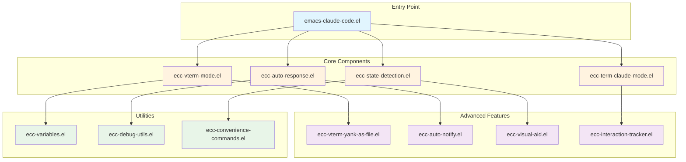

<!-- ---
!-- Timestamp: 2025-05-26 10:54:45
!-- Author: ywatanabe
!-- File: /home/ywatanabe/.emacs.d/lisp/emacs-claude-code/README.md
!-- --- -->

# Emacs Claude Code
This repository provides a comprehensive Claude Code interface for Emacs with intelligent auto-response capabilities, advanced vterm integration, and productivity enhancements.


## Architecture



## Installation
Installation guide is available at [`./docs/installation.md`](./docs/installation.md)

## Quick Start
```elisp
;; Add to your init.el
(add-to-list 'load-path "~/.emacs.d/lisp/emacs-claude-code")
(require 'emacs-claude-code)

;; Start Claude terminal
(ecc-vterm)

;; Toggle auto-response mode globally
(ecc-auto-response-toggle)

;; Toggle auto-response for current buffer only
(ecc-auto-response-buffer-local-toggle)

;; Yank vterm content as file with auto-detection
(ecc-vterm-yank-as-file)
```

## Details
- Core features and vterm integration [`./docs/core-features.md`](./docs/core-features.md)
- Auto-response system (global and buffer-local) [`./docs/auto-response.md`](./docs/auto-response.md)
- Visual aids and color themes [`./docs/visual-enhancements.md`](./docs/visual-enhancements.md)
- State detection and interaction tracking [`./docs/state-detection.md`](./docs/state-detection.md)
- Configuration and customization [`./docs/configuration.md`](./docs/configuration.md)
- Testing and development workflow [`./docs/testing.md`](./docs/testing.md)
- Debug utilities and troubleshooting [`./docs/debug-usage.md`](./docs/debug-usage.md)

## Contact
Yusuke Watanabe (ywatanabe@alumni.u-tokyo.ac.jp)

<!-- EOF -->