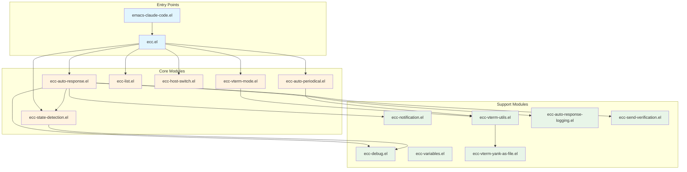

<!-- ---
!-- Timestamp: 2025-06-04 08:04:16
!-- Author: ywatanabe
!-- File: /home/ywatanabe/.emacs.d/lisp/emacs-claude-code/README.md
!-- --- -->

# Emacs Claude Code

Emacs interface for Claude Code with intelligent auto-response, centralized buffer management, and enhanced vterm integration following a `1 buffer = 1 Claude agent` and `human-in-the-loop` design.

### Key Benefits
- **Uninterrupted Workflow**: Auto-response keeps Claude working continuously
- **Multi-Session Support**: Manage multiple Claude agents across different hosts
- **Smart Integration**: Enhanced vterm with file handling and command execution
- **Full Control**: Monitor and manage all sessions from a centralized interface
- **Periodic Maintenance**: Automatic periodic commands keep sessions healthy and responsive

## Demo: Automatic Response System

*Auto-response in action: initial-waiting → /user/understand-guidelines, y/n → 1, y/y/n → 2, waiting → /user:auto
(Assumes commands ~/.claude/commands/{understand-guidelines.md,auto.md} exist)*

## Table of Contents
- [Installation](#installation)
- [Quick Start](#quick-start)
- [Key Features](#key-features)
- [Buffer Management](#buffer-management)
- [Architecture](#architecture)
- [Configuration](#configuration)
- [Documentation](#documentation)
- [Reference Materials](#reference-materials)
- [Contact](#contact)

## Installation

```bash
# Clone the repository
git clone https://github.com/ywatanabe1989/emacs-claude-code.git ~/.emacs.d/lisp/emacs-claude-code

# Add to your init.el
(add-to-list 'load-path "~/.emacs.d/lisp/emacs-claude-code")
(require 'emacs-claude-code)
```

For detailed installation instructions, see [`./docs/installation.md`](./docs/installation.md).

## Buffer Management
```plaintext
ECC Claude Buffer List
=====================

    Buffer Name                    Auto-Response   Last Sent    State
─── ─────────────────────────────  ──────────────  ──────────── ─────
    mngs-07:02:07                  Enabled         07:32:09     Running
    claude-04:50-80-01             Enabled         07:17:17     None
    mngs2                          Enabled         Never        Running
    inits-04:18-80-01              Disabled        Never        None
    inits-04:18-160-01             Disabled        Never        None
    gpac-sp-claude-04:15-160-0...  Disabled        Never        None
    claude-04:50-160-01            Disabled        Never        None
    mngs-sp-claude-04:16-160-0...  Disabled        Never        None
    gpac-sp-claude-04:15-80-01...  Disabled        Never        None

Commands:
  RET/SPC  - Jump to buffer          a  - Toggle auto-response
  o        - Display in other window  d  - Kill buffer(s)
  m/u/U    - Mark/Unmark/Unmark all  t  - Toggle marks
  g        - Refresh list             r  - Toggle auto-refresh
  n/p      - Navigate                 q  - Quit

Auto-refresh: ON (every 2.0s)
```

## Architecture



## Quick Start

### Basic Setup
```elisp
;; Add to your init.el
(add-to-list 'load-path "~/.emacs.d/lisp/emacs-claude-code")
(require 'emacs-claude-code)
```

### Essential Commands
```elisp
;; Main commands
(ecc-list-buffers)        ; Show all Claude buffers with status
(ecc-auto-toggle)         ; Toggle auto-response for current buffer
(ecc-switch-host)         ; Switch to different host/machine
(ecc-notification-toggle) ; Toggle desktop notifications
(ecc-debug-toggle)        ; Toggle debug mode
```

### Recommended Configuration
```elisp
;; Configure auto-response patterns
(setq --ecc-auto-response-responses
  '((:y/n . "1")                              ; Respond "1" to Y/N prompts
    (:y/y/n . "2")                            ; Respond "2" to Y/Y/N prompts
    (:waiting . "/user:auto")                 ; Send /user:auto when waiting
    (:initial-waiting . "/user:understand-guidelines"))) ; Initial waiting response

;; Enable useful features
(ecc-auto-periodical-toggle)                  ; Enable auto-periodical commands
(--ecc-vterm-utils-enable-yank-advice)        ; Enable yank-as-file for large content

;; Fine-tune behavior (optional)
(setq --ecc-vterm-yank-as-file-threshold 100)    ; Prompt threshold for yank-as-file
(setq --ecc-auto-response-periodic-interval 300) ; 5 minutes periodic return
(setq ecc-auto-periodical-commands              ; Commands to run periodically
  '((10 . "/compact")                            ; Run /compact every 10 interactions
    (20 . "/user:auto")))                        ; Run /user:auto every 20 interactions
```

## Key Features

### Core Features
- **Auto-Response System**: Automatically responds to Claude prompts (Y/N, Continue, etc.)
- **Buffer Management**: Centralized list view to navigate between Claude terminal sessions
- **State Detection**: Intelligent detection of Claude's current state
- **Desktop Notifications**: Get notified when Claude needs attention
- **Debug Mode**: Built-in debugging for troubleshooting
- **Host Switching**: Seamlessly switch between local and SSH hosts
  - Parses SSH config files automatically
  - Supports ~/.ssh/conf.d/* configurations
  - Quick switching with completion

### New in v2.1.0
- **Yank-as-File**: Automatically saves large yanked content to temporary files
  - Smart file type detection (Python, JS, HTML, CSS, Elisp, Shell)
  - Configurable thresholds (100+ chars prompts, 500+ chars auto-saves)
  - Sends file references to Claude instead of pasting large blocks
- **Auto-Periodical Commands**: Execute commands at regular intervals
  - Default: `/compact` every 10 interactions
  - Fully configurable command list and intervals
- **Periodic Return Sending**: Improves auto-response reliability
  - Sends return key every 5 minutes to resolve timing issues
  - Buffer-local timers for multi-session support
- **Enhanced Logging**: Comprehensive auto-response logging for debugging
  - Tracks all state transitions and responses
  - Buffer-local log files for each session

## Documentation

### User Guides
- [Auto-response System](./docs/auto-response.md) - How automatic responses work
- [Buffer Management](./docs/buffer-management.md) - Managing multiple Claude sessions
- [Configuration Options](./docs/configuration.md) - Customizing ECC behavior
- [Debug Utilities](./docs/debug-usage.md) - Troubleshooting and debugging
- [Installation Guide](./docs/installation.md) - Detailed setup instructions

### Additional Resources
- [Yank-as-File Usage](./docs/yank-as-file-usage.md) - Working with large content
- [Test Refactoring Guide](./docs/test-refactoring-guide.md) - Contributing to tests

## Contact
Yusuke Watanabe (ywatanabe@alumni.u-tokyo.ac.jp)

<!-- EOF -->