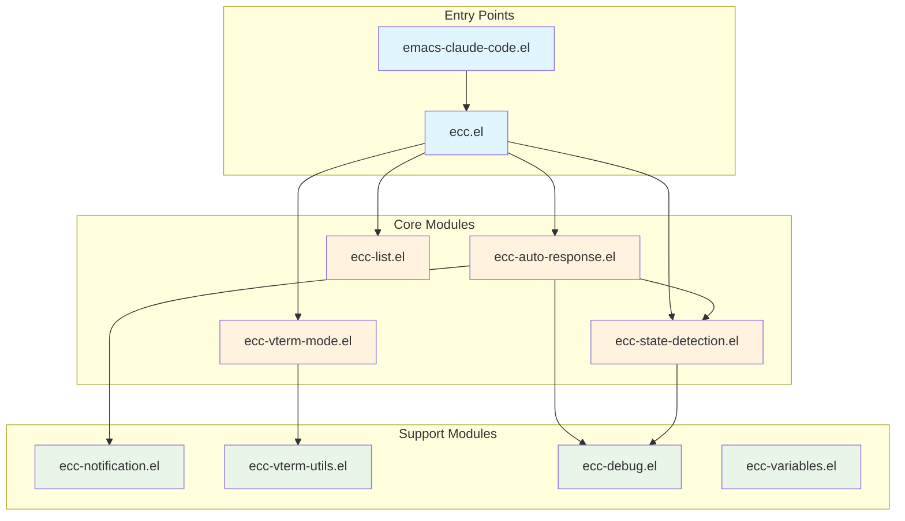

<!-- ---
!-- Timestamp: 2025-05-26 10:54:45
!-- Author: ywatanabe
!-- File: /home/ywatanabe/.emacs.d/lisp/emacs-claude-code/README.md
!-- --- -->

# Emacs Claude Code
Simplified Emacs interface for Claude with auto-response capabilities and vterm integration.


## Architecture



## Installation
Installation guide is available at [`./docs/installation.md`](./docs/installation.md)

## Quick Start
```elisp
;; Add to your init.el
(add-to-list 'load-path "~/.emacs.d/lisp/emacs-claude-code")
(require 'emacs-claude-code)

;; Main commands
(ecc-auto-toggle)         ; Toggle auto-response for current buffer
(ecc-list-buffers)        ; Show all Claude buffers with status
(ecc-notification-toggle) ; Toggle desktop notifications
(ecc-debug-toggle)        ; Toggle debug mode

;; The package automatically enhances vterm-mode buffers
;; with Claude-specific features when enabled
```

## Key Features

- **Auto-Response System**: Automatically responds to Claude prompts (Y/N, Continue, etc.)
- **Buffer Management**: List and navigate between Claude terminal sessions
- **State Detection**: Intelligent detection of Claude's current state
- **Desktop Notifications**: Get notified when Claude needs attention
- **Debug Mode**: Built-in debugging for troubleshooting

## Details
- Auto-response system [`./docs/auto-response.md`](./docs/auto-response.md)
- Buffer management [`./docs/buffer-management.md`](./docs/buffer-management.md)
- Configuration options [`./docs/configuration.md`](./docs/configuration.md)
- Debug utilities [`./docs/debug-usage.md`](./docs/debug-usage.md)

## Contact
Yusuke Watanabe (ywatanabe@alumni.u-tokyo.ac.jp)

<!-- EOF -->