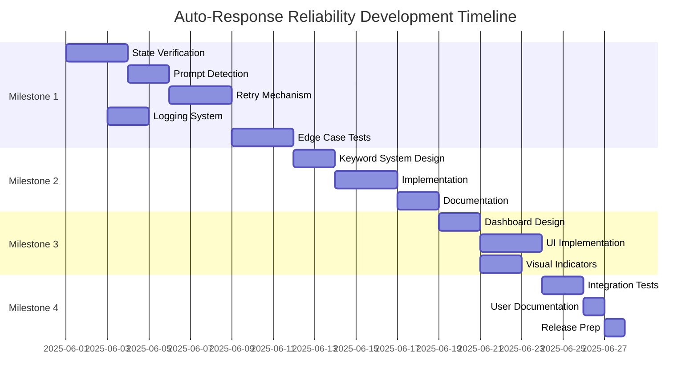

# Timeline - Phase 3: Auto-Response Reliability
Generated: 2025-05-31

## Gantt Chart

## Key Dates

### Week 1 (June 1-7)
- **June 1-3**: Implement state-based send verification
- **June 3-5**: Add prompt empty detection  
- **June 5-7**: Create retry mechanism

### Week 2 (June 8-14)
- **June 8-10**: Complete edge case tests
- **June 10-12**: Design centralized keyword system
- **June 12-14**: Implement keyword system

### Week 3 (June 15-21)
- **June 15-16**: Document safety mechanisms
- **June 17-18**: Design multi-buffer dashboard
- **June 19-21**: Implement UI improvements

### Week 4 (June 22-24)
- **June 22-23**: Integration testing
- **June 24**: Documentation and release

## Dependencies

1. **Parallel Work Possible**:
   - Logging system (while doing state verification)
   - Visual indicators (while doing dashboard)

2. **Sequential Requirements**:
   - State verification → Retry mechanism
   - Keyword design → Implementation
   - All development → Testing → Documentation

## Risk Buffer
- 2 extra days built into timeline
- Can extend by 1 week if needed
- Feature flags allow partial release

## Success Metrics
- [ ] All timing issues resolved
- [ ] 95%+ send success rate
- [ ] Zero timer errors in 24h operation
- [ ] User satisfaction improvement

## Review Points
- End of Week 1: Core reliability check
- End of Week 2: Safety architecture review
- End of Week 3: UI/UX review
- End of Week 4: Release readiness